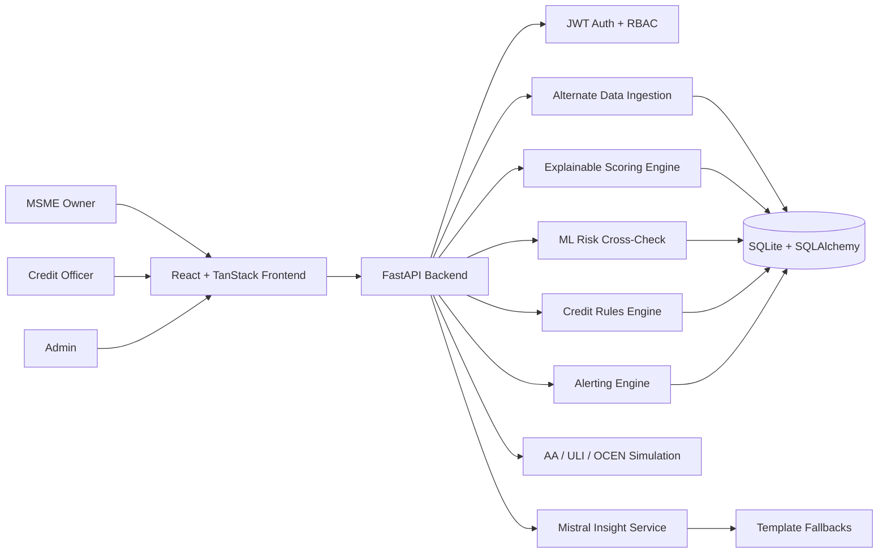
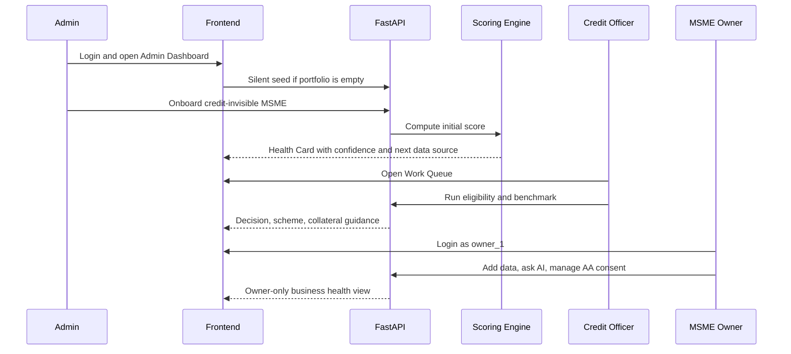

# Vishwas AI

<p align="center">
  <b>Smarter Credit Assessment for Every MSME</b><br />
  Alternate data, explainable AI, and role-based credit workflows for inclusive MSME lending.
</p>

<p align="center">
  
</p>

<p align="center">
  
</p>

<p align="center">
  
  
  
  
  
  
</p>

---

## Problem Statement

India's MSMEs power jobs, supply chains, exports, and local entrepreneurship, yet many remain under-served by formal credit. Traditional lending depends heavily on audited statements, collateral, long banking history, and formal documentation. New-to-Credit and New-to-Bank MSMEs often have real business activity but fragmented proof: GST filings, UPI receipts, EPFO records, bank transactions, and business notes live in different silos.

The challenge is to convert these alternate signals into a trusted, explainable, near real-time financial health view that helps banks assess MSMEs fairly while helping business owners understand how to improve.

## Solution Overview

Vishwas AI is a full-stack credit intelligence platform that converts alternate data into an explainable Financial Health Score, AI-generated insights, role-based workflows, simulated AA/ULI/OCEN integrations, and credit decision support.

It is designed around one core belief: MSME credit assessment should be inclusive without becoming opaque. The system uses deterministic scoring rules for regulatory clarity, an ML model as a second opinion, and Mistral-powered explanations with fallback narratives so decisions stay understandable even when AI services are unavailable.

## What Makes Vishwas AI Different

- Explainable first: the score is computed using transparent rules, not a black-box LLM.
- Confidence-aware: sparse-data MSMEs receive an indicative score plus next-best data guidance instead of instant rejection.
- Full role separation: Admin, Credit Officer, and MSME Owner each see only the workflows they should own.
- Lending-stack ready: AA consent, ULI loan application, and OCEN assessment are simulated with realistic API shapes.
- Portfolio intelligence: banks can move from one-time assessment to continuous monitoring through alerts, benchmarks, and portfolio summaries.
- Demo-ready data: silent initialization keeps the product experience clean while still making the app immediately explorable.

## Feature Set

| Area | Capability | Why It Matters |
|---|---|---|
| Alternate data ingestion | GST, UPI, EPFO, bank statements, unstructured business notes | Builds a credit profile beyond traditional paperwork |
| Financial Health Card | Score, grade, risk band, confidence, dimensions, trend, strengths, risks | Gives both bank and MSME a shared truth layer |
| Explainable scoring | Cash flow, compliance, workforce, banking behavior, digital footprint | Makes assessment defensible and auditable |
| AI insights | Summary, Q&A, what-if, anomaly explanation | Turns raw score data into plain-language action |
| ML cross-check | scikit-learn risk classifier flags divergence from rules | Adds AI/ML depth while preserving human review |
| AA simulation | Request, approve, revoke, status consent lifecycle | Mirrors Account Aggregator style data access |
| ULI/OCEN simulation | Loan application, status, credit assessment | Shows readiness for India's digital lending ecosystem |
| Credit decision support | Eligibility, scheme suggestion, collateral guidance, benchmark | Helps credit teams act, not just observe |
| Alerts | Score drops, compliance issues, anomalies, consent events | Supports ongoing portfolio quality |
| Role-based frontend | Admin, Credit Officer, MSME Owner experiences | Keeps the product operationally realistic |

## Role-Based Experience

The current frontend uses three clear personas.

| Role | Login | Primary Experience | Key Permissions |
|---|---|---|---|
| Admin | `admin / password123` | Admin Dashboard | Onboard MSMEs, review portfolio, monitor alerts, use credit and ULI/OCEN tools |
| Credit Officer | `credit_officer / password123` | Credit Officer Dashboard with Work Queue | Assess MSMEs, browse portfolio, run eligibility, benchmark, review alerts |
| MSME Owner | `owner_1 / password123` | My Business Health | View only linked MSME, add business data, view health card, ask AI, manage consent and alerts |

Demo data is intentionally hidden from the UI. If the database is empty, logging in as a demo user silently seeds the portfolio in the background. Users experience the application as a real populated platform, not a seed/reset playground.

## Architecture Diagram



## Demo Journey



## Technology Stack

| Layer | Technology |
|---|---|
| Frontend | React 19, TypeScript, Vite, TanStack Router, TanStack Query, Tailwind CSS, Radix UI, Recharts, lucide-react |
| Backend | FastAPI, Python, Uvicorn, Pydantic, Pydantic Settings |
| Database | SQLite with SQLAlchemy ORM |
| Authentication | JWT, python-jose, passlib, bcrypt |
| AI | Mistral API integration with fallback summaries |
| ML and Analytics | scikit-learn, pandas, numpy, joblib |
| Synthetic Data | Faker and custom data generators |
| Integrations | Simulated Account Aggregator, ULI, and OCEN endpoints |

## Scoring Model

The Financial Health Score is a weighted score across five dimensions:

| Dimension | Weight | Signal Source |
|---|---:|---|
| Cash Flow Stability | 25% | UPI transaction patterns |
| Compliance Health | 25% | GST filing status and turnover consistency |
| Statutory and Workforce Stability | 15% | EPFO contribution and headcount stability |
| Banking Behavior | 25% | AA-style bank statement behavior |
| Digital Footprint and Formalization | 10% | UPI footprint and Udyam formalization |

The system also computes:

- Grade and risk band
- Confidence score
- Data quality label
- Top strengths and risks
- ML predicted risk band
- Rule-vs-ML divergence flag
- Recommended next data source for sparse profiles

## Product Impact

Vishwas AI helps banks and MSMEs move from "missing documents" to "measurable trust."

For MSMEs:

- Opens a path for credit-invisible businesses to be assessed through actual operating signals.
- Shows what is helping or hurting the score.
- Gives practical improvement guidance through AI insights and what-if simulations.

For banks:

- Speeds up preliminary credit assessment.
- Supports priority-sector and MSME lending workflows.
- Improves portfolio monitoring through alerts and risk summaries.
- Keeps human decision-makers in control with explainable rules and ML second opinions.

For the ecosystem:

- Demonstrates how AA, ULI, OCEN, GST, UPI, and EPFO-style signals can work together.
- Turns fragmented digital trails into inclusive lending intelligence.

## Repository Guide

Use this map when looking for project information.

| File / Folder | What You Will Find |
|---|---|
| `README.md` | Main project story, problem statement, solution, architecture, impact, and navigation |
| `SETUP_GUIDE.md` | Step-by-step local setup for backend, frontend, env, demo login, and troubleshooting |
| `FOLDER_STRUCTURE.md` | Complete repository layout and purpose of major folders/files |
| `FEATURES_IMPACT_UNIQUENESS.md` | Detailed feature-by-feature impact and uniqueness explanation |
| `requirements.txt` | Root Python dependency list for backend setup reference |
| `MANUAL_FRONTEND_TESTING_GUIDE.md` | Manual test script for role-based frontend and backend flows |
| `PS3_MSME_FinHealth_Implementation_Plan.md` | Original implementation plan and business/technical blueprint |
| `Vishwas_ai_backend/` | FastAPI backend, data models, routers, services, scoring, AI, and integrations |
| `Vishwas_ai_frontend/` | React/TanStack frontend, routes, UI components, API client, and assets |
| `Vishwas_ai_backend/.env.example` | Backend environment variable template |
| `Vishwas_ai_frontend/package.json` | Frontend scripts and JavaScript dependencies |

## Quick Start

Backend:

```powershell
cd .\Vishwas_ai_backend
python -m venv .venv
.\.venv\Scripts\Activate.ps1
python -m pip install -r requirements.txt
python -m uvicorn app.main:app --host 127.0.0.1 --port 8000
```

Frontend:

```powershell
cd .\Vishwas_ai_frontend
npm install
npm run dev -- --host 127.0.0.1 --port 5173
```

Open:

- Frontend: `http://127.0.0.1:5173`
- Backend health: `http://127.0.0.1:8000/health`
- Swagger API docs: `http://127.0.0.1:8000/docs`

## Important API Areas

| Area | Endpoints |
|---|---|
| Auth | `/auth/register`, `/auth/login`, `/auth/me` |
| MSME | `/msme/onboard`, `/msme/`, `/msme/{id}` |
| Data | `/data/gst/{id}`, `/data/upi/{id}`, `/data/epfo/{id}`, `/data/bank-statement/{id}`, `/data/unstructured/{id}` |
| Scoring | `/score/compute/{id}`, `/score/{id}`, `/score/{id}/history`, `/score/{id}/card` |
| Insights | `/insights/{id}/summary`, `/insights/{id}/ask`, `/insights/{id}/what-if`, `/insights/{id}/anomalies` |
| Credit | `/credit/eligibility-check`, `/credit/portfolio-summary`, `/credit/benchmark/{id}` |
| AA | `/aa/consent/request`, `/aa/consent/{id}/approve`, `/aa/consent/{id}/revoke`, `/aa/consent/{id}/status` |
| ULI/OCEN | `/uli/loan-application`, `/uli/loan-application/{id}/status`, `/ocen/credit-assessment` |
| Alerts | `/alerts/`, `/alerts/{id}`, `/alerts/{id}/acknowledge` |

<details>
<summary><b>Demo Script</b></summary>

1. Open the frontend.
2. Login as `admin / password123`.
3. Show the Admin Dashboard and portfolio metrics.
4. Onboard a new credit-invisible MSME.
5. Open its Health Card and explain confidence scoring.
6. Add alternate data and recompute the score.
7. Generate AI summary, Q&A, and what-if insight.
8. Logout and login as `credit_officer / password123`.
9. Show Work Queue, eligibility, benchmark, ULI, OCEN, and alerts.
10. Logout and login as `owner_1 / password123`.
11. Show owner-only business health view and restricted access behavior.

</details>

<p align="center">
  
</p>

---

<h2 align="center">
  <strong>Because Every Business Deserves a Chance,<br />and Every Chance Begins with Vishwas.</strong>
</h2>
